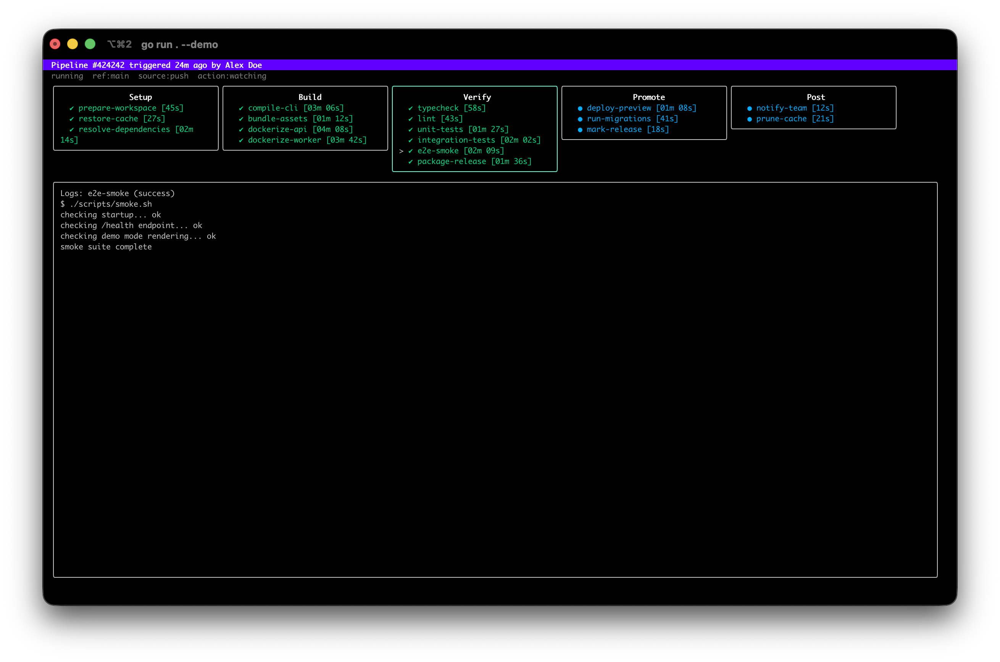

# glab-overseer

`glab-overseer` is a terminal watcher for GitLab pipelines.

It uses the GitLab REST API directly, polls for new pipelines, triggers actions
when a new pipeline appears, and shows live stage/job progress with job logs in
a terminal UI inspired by `glab ci view`.



## Features

- pure HTTP calls to GitLab, no `glab` and no SDKs
- polling-based pipeline detection
- deduped new-pipeline triggers across restarts
- async actions: `none`, `log`, `open`
- stage/job TUI with live trace polling
- recent pipelines overview homepage
- release binaries for macOS and Linux

## Install

From source:

```bash
go install github.com/arvindell/glab-overseer@latest
```

Or download a binary from GitHub Releases.

With the install script:

```bash
curl -fsSL https://raw.githubusercontent.com/arvindell/glab-overseer/main/install.sh | sh
```

With Homebrew:

```bash
brew tap arvindell/tap
brew install glab-overseer
```

## Config

Copy `.env.example` to `.env` and fill in:

```env
GITLAB_HOST=https://gitlab.com
GITLAB_PROJECT=group/project
GITLAB_TOKEN=your_gitlab_pat
GITLAB_REF=
OVERSEER_POLL_INTERVAL=15s
OVERSEER_TRACE_INTERVAL=3s
OVERSEER_ACTION=log
```

Required:

- `GITLAB_PROJECT`
- `GITLAB_TOKEN`

The token should have `read_api` access.

## Run

```bash
glab-overseer --project group/project
```

Or from the repo:

```bash
go run . --project group/project
```

Useful flags:

- `--demo`
- `--ref`
- `--interval`
- `--trace-interval`
- `--action`
- `--state-file`

## Demo Mode

For screenshots or demos without exposing real pipelines, run:

```bash
glab-overseer --demo
```

This uses built-in fake pipeline, job, and log data and does not require a
GitLab token or project.

## Keybindings

- `up` / `down`: move through pipelines in overview mode
- `Enter`: inspect the selected pipeline from the overview
- `b`: go back to the overview from the inspector
- `left` / `right`: change stage
- `up` / `down`: change job
- `Enter`: open log viewer mode for the selected job
- `Esc`: leave log viewer mode and return to preview mode
- `F`: reactivate default focus mode
- `PageUp` / `PageDown`: scroll logs
- `Ctrl+U` / `Ctrl+D`: half-page log scroll
- `Home` / `End`: jump to top / bottom of logs
- `g` / `G`: top / bottom of logs
- `q`: quit

## Focus Modes

There are two focus modes:

- `default`: automatically cycles through running jobs with logs every 10 seconds
- `user`: activated when you manually move focus

When a new pipeline appears, focus resets to the default mode.

Press `F` at any time to switch back to default mode.

In stage selection mode, the log pane shows a live preview of the latest log
lines for the selected job. Press `Enter` to switch into log viewer mode for
manual scrolling, and `Esc` to return to preview mode.

## Overview Mode

The app now starts on a pipeline overview homepage that shows recent pipelines,
their refs, statuses, authors, and a compact stage summary.

Select a pipeline and press `Enter` to inspect it with the detailed stage and
log viewer.

When a new pipeline is detected, the app automatically opens it in inspect
mode. If that pipeline succeeds, the UI returns to the overview automatically.

If the currently inspected pipeline fails, the stage and log pane borders turn
red.

## Development

```bash
gofmt -w .
go test ./...
go vet ./...
go build ./...
```

## Project Docs

- [`CONTRIBUTING.md`](./CONTRIBUTING.md)
- [`SECURITY.md`](./SECURITY.md)
- [`CODE_OF_CONDUCT.md`](./CODE_OF_CONDUCT.md)
- [`CHANGELOG.md`](./CHANGELOG.md)
- [`LICENSE`](./LICENSE)
